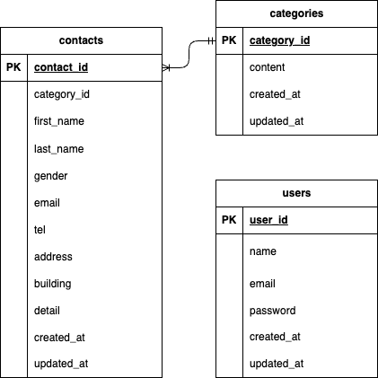

# プロジェクト名

お問い合わせフォーム

# 概要

お問い合わせをするアプリです
管理者として登録・ログインすることで、管理ページを閲覧・検索・削除することができます

## 環境
- php バージョン: 8.1
- Laravel バージョン: 8.83
- データベース: MySQL (Docker 使用)

## セットアップ手順

1. このリポジトリをクローン
```bash
git clone git@github.com:haruna-satoh/test-contact-form.git
cd contact-form
```

2. Dockerを起動
```bash
docker compose up -d --build
```

3. .envファイルを作成
```bash
cp src/.env.example src/.env
```

4. Laravelアプリケーションのセットアップ
phpコンテナ内で実行
```bash
docker compose exec php bash
composer install
php artisan key:generate
php artisan migrate --seed
```

## ER図


## URL

- [http://localhost](http://localhost)
    →お問い合わせ入力ページが表示されます
- [http://localhost/login](http://localhost/login)
    →管理者用ログインページが表示されます
- [http://localhost:8080/](http://localhost:8080/)
    →phpMyAdminが開き、DBを確認できます